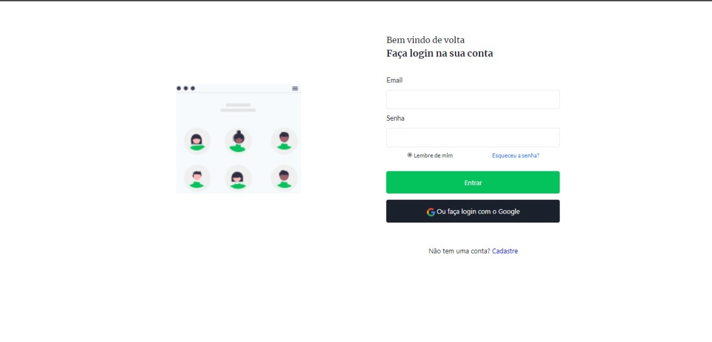
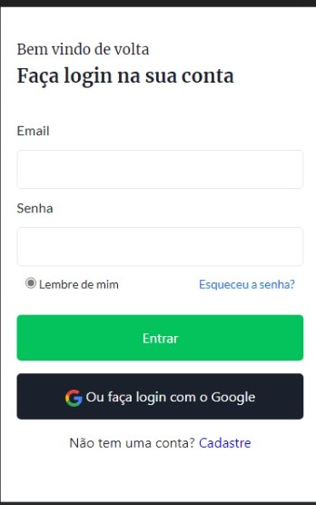

# Desafio 4 - Codelândia

Nesse projeto, o objetivo era criar uma tela de login, contudo acrescentei, validações de email e senha.

## Stack utilizada

**Front-end:** JavaScript, html e css.

## [Site](https://desafio4-tela-login.vercel.app/)

## Veja como ficou

## Minha redes sociais
[Linkedin](https://www.linkedin.com/in/devamauryjr/)
[Github](https://github.com/devamauryjunior)

## Quem criou o layout
[@iuricode](https://www.instagram.com/accounts/login/?next=/iuricode/)

